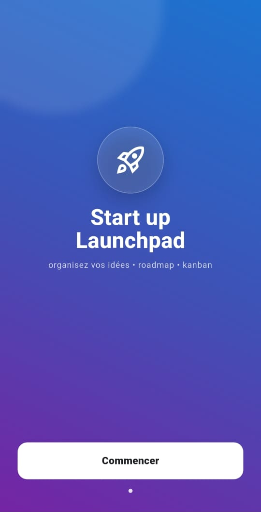
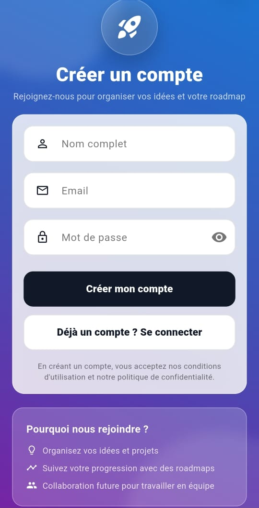
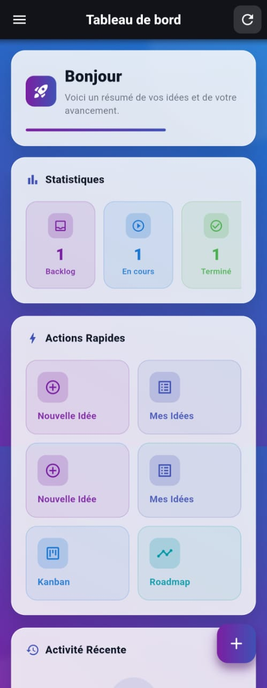
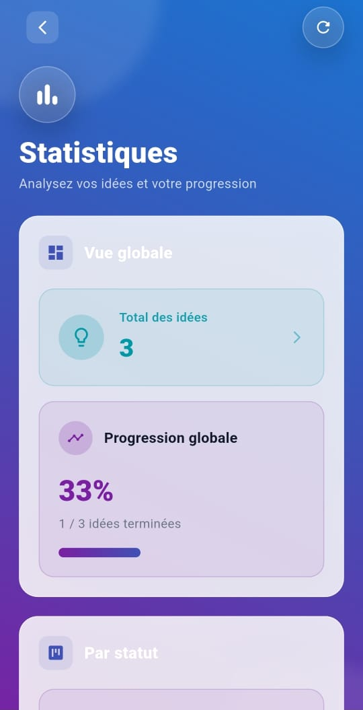
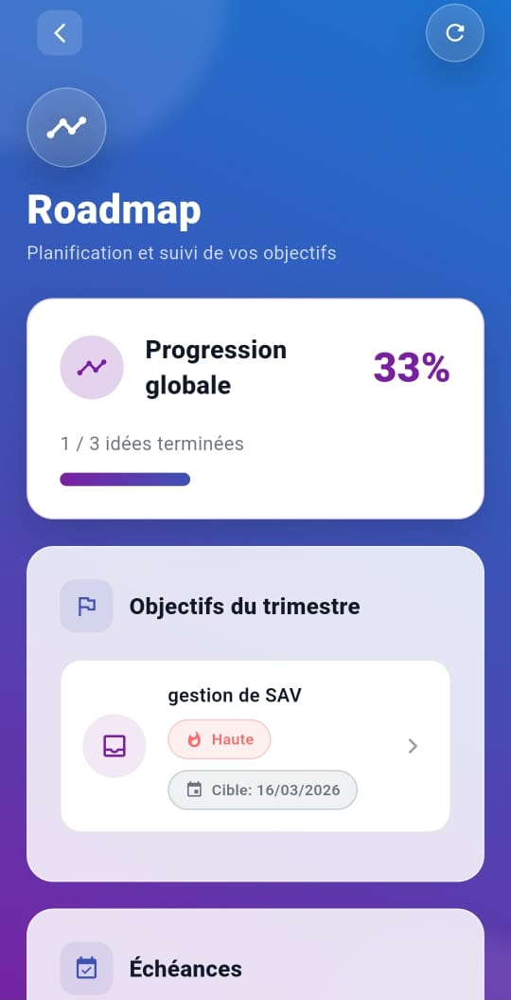
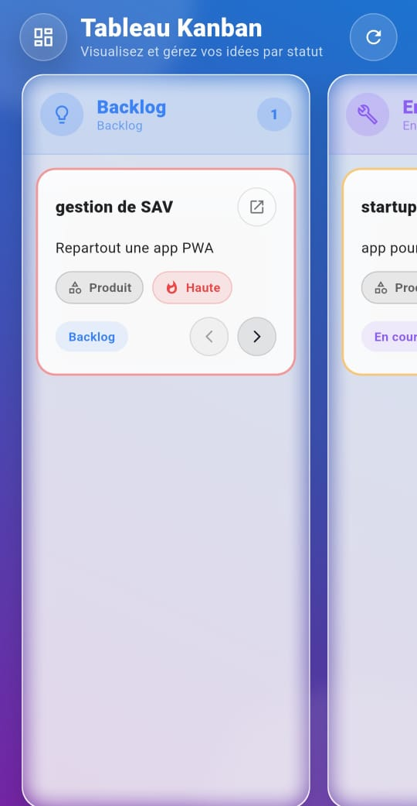
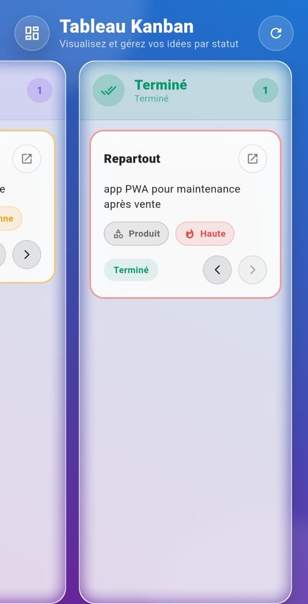
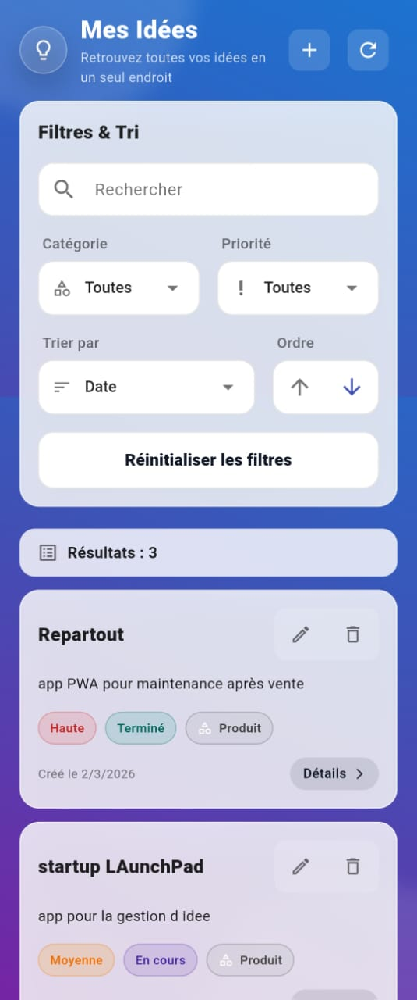
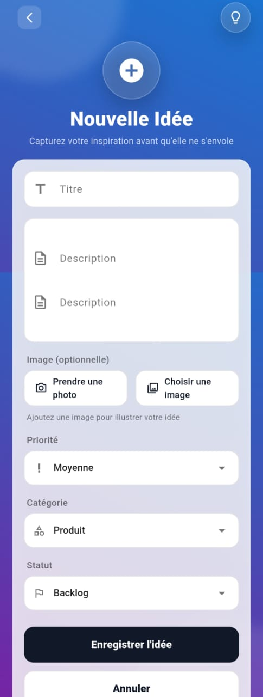

# 🛸 Startup LaunchPad

<p align="center">
  
</p>

<p align="center">
  <b>L'architecte de votre innovation.</b><br>
  [cite_start]Une expérience fluide pour transformer l'intuition en exécution réelle[cite: 4, 11].
</p>

<p align="center">
  
  
  
</p>

---

### 🖋️ Le Concept
[cite_start]**Startup LaunchPad** est une application mobile conçue pour lever les barrières entre l'idéation et l'exécution[cite: 4]. [cite_start]Elle permet aux innovateurs de centraliser leurs réflexions, de structurer leurs priorités et de visualiser l'avancement de leur projet à travers un environnement fluide et utilisable **100% hors-ligne**[cite: 6, 26].

---

### 🏗️ Ingénierie & Architecture
[cite_start]L'application repose sur une séparation stricte des préoccupations pour garantir performance et maintenabilité[cite: 104]:

| 💻 Stack Core | 📐 Patterns |
| :--- | :--- |
| [cite_start]**Framework:** Flutter [cite: 99] | [cite_start]**Architecture:** MVS (Modèle-Vue-Service) [cite: 104] |
| **Langage:** Dart | [cite_start]**State Management:** Provider / Riverpod / Bloc [cite: 102] |
| [cite_start]**Base de données:** SQLite [cite: 16, 70] | [cite_start]**Logic:** Repository Pattern [cite: 104] |
| [cite_start]**Analytics:** fl_chart [cite: 65] | [cite_start]**UI:** Kanban Design [cite: 14, 39] |

---

### 🕹️ Expérience Produit

#### 🧠 Gestion d'Idées Intelligente
* [cite_start]**Centralisation multidimensionnelle** : Organisation par catégories (Tech, Marketing, Business, Produit)[cite: 33].
* [cite_start]**Priorisation stratégique** : Système de tri par niveaux d'importance (Haute, Moyenne, Basse)[cite: 32, 84].
* [cite_start]**Moteur de recherche** : Indexation textuelle pour retrouver vos idées instantanément[cite: 38].

#### 📊 Écosystème Kanban
* [cite_start]**Flux dynamique** : Visualisation en 3 étapes : *Backlog*, *In Progress*, et *Done*[cite: 40, 41, 42, 43].
* [cite_start]**Gestion intuitive** : Mise à jour fluide des statuts via drag-and-drop ou boutons dédiés[cite: 45, 86].
* [cite_start]**Monitoring** : Compteurs d'activité intégrés pour chaque colonne de flux[cite: 47].

#### 📈 Roadmap & Analytics
* [cite_start]**Progression visuelle** : Monitoring global via des indicateurs circulaires et barres de progression[cite: 57, 63].
* [cite_start]**Insights** : Graphiques détaillés de la répartition des efforts par catégorie et priorité[cite: 61, 62].

---

### 📂 Anatomie du Code
```bash
lib/
├── database/     # Schémas et gestion SQLite (startup.db) [cite: 71]
├── models/       # Entités Ideas & Data Structures [cite: 104]
├── pages/        # Écrans Dashboard, Kanban & Roadmap [cite: 104]
├── repositories/ # Couche d'accès aux données persistantes [cite: 104]
├── services/     # Logique métier et calculs statistiques [cite: 104]
├── widgets/      # Composants UI atomiques et animations [cite: 104]
└── main.dart     # Point d'entrée & State Management
```
### 📱 Aperçu de l'Expérience

#### 🏗️ Démonstration Interactive
<p align="center">
  
</p>

#### 🎨 Onboarding & Authentification
<p align="center">
  
  
  
</p>

#### 📊 Dashboard & Pilotage
<p align="center">
  
  
  
</p>

<details>
  <summary>📸 Voir la galerie complète (Interface détaillée)</summary>
  <br>
  <p align="center">
    
    
    
    
    
    
    
    
  </p>
</details>
